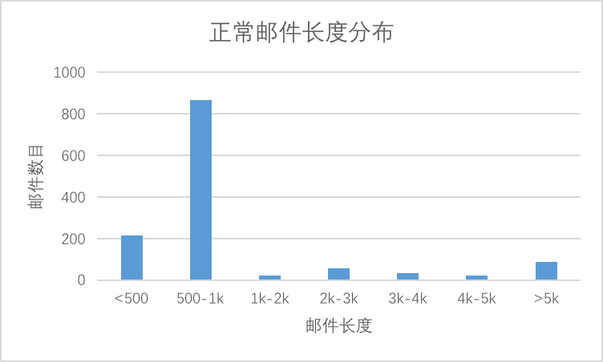
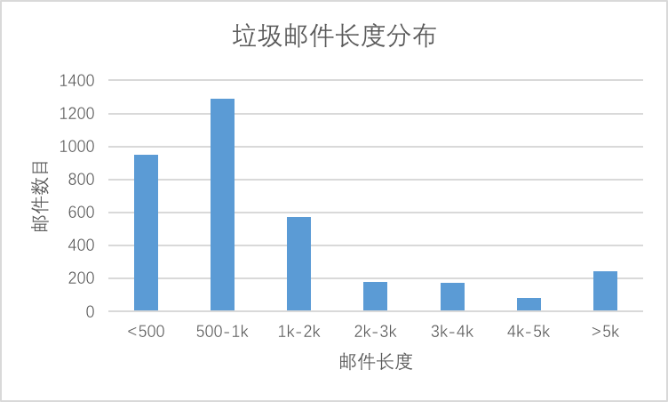
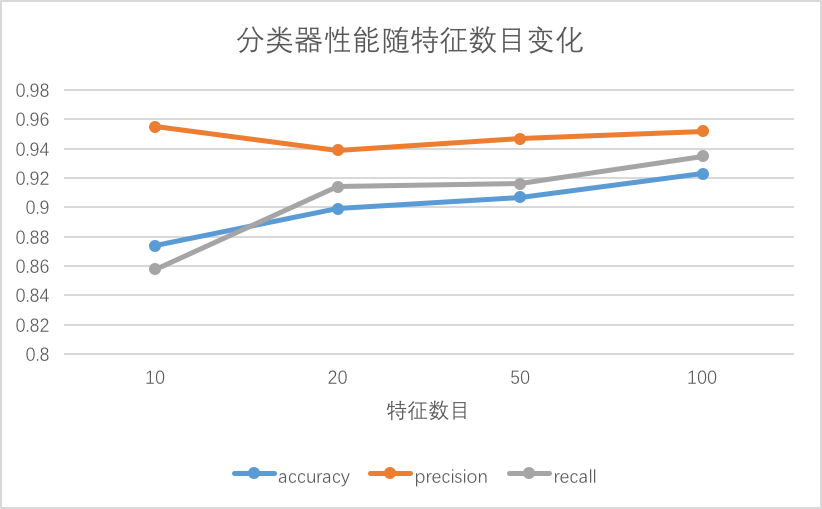
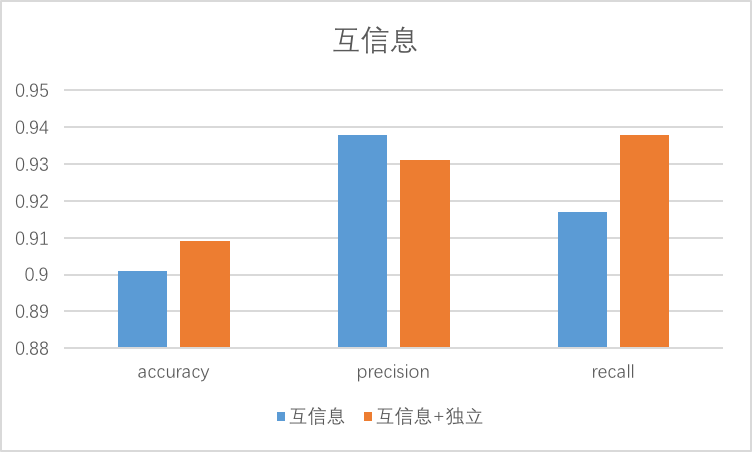
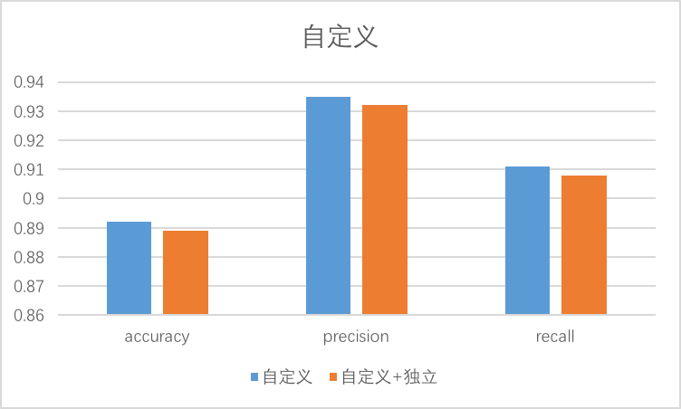
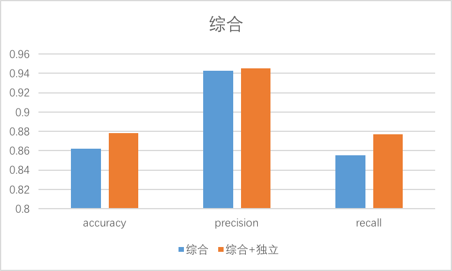

# 实验报告

*施韶韵 计34 2013011358*

## 实验目的

在垃圾邮件识别问题上，改进朴素贝叶斯分类器。

## 实验原理

记某个文档 $d = (t_1, t_2, ..., t_k)$，其中$t_i$为文档中的单词  
则某个文档$d$属于类$c$的概率为
$$P(c|t_1t_2...t_k) = \frac{P(t_1t_2...t_k|c)P( c )}{P(t_1t_2...t_k)}$$
假设单词出现概率相互独立，则
$$P(c|t_1t_2...t_k) = \frac{P(t_1|c)P(t_2|c)...P(t_k|c)P( c )}{P(t_1t_2...t_k)}$$
则对于文档$d$在类别集合$C$中的分类为
$$max\ P(c|t_1t_2...t_k), c\in C$$

## 实验数据

- 数据集：http://plg.uwaterloo.ca/~gvcormac/treccorpus06/
- 定义垃圾邮件为正例，正常邮件为负例，数据中正例约占0.7

## 实验内容

### 基本框架

- 伯努利模型
$$ P( c ) = \frac{类c下文件总数}{整个训练样本的文件总数} $$
$$ P(t_i|c) =\frac{类c下包含单词t_i的文件数+1}{c下的文件总数+2}$$
> 其中平滑的添加实际意义是向每个类别中新增了两个文件：空文件；包含所有单词各一个的文件。

- 多项式模型
$$ P( c ) = \frac{类c下单词总数}{整个训练样本的单词总数}$$
$$ P(t_i|c) = \frac{类c下单词t_i在各个文档中出现过的次数之和+1}{类c下单词总数+训练集中不同单词的个数}$$
> 其中平滑添加的实际意义是向每个类别中新增一个文件，包含所有训练集单词各一个。

- 框架对比

    > 取1000个数据，其中随机抽取一半作为训练集，另一半作为测试集
    
                       | accuracy | precision | recall 
    -------------------|----------|-----------|--------
    伯努利模型           | 0.836    | 0.997     | 0.804 
    多项式模型           | 0.976    | 0.983     | 0.988  
    
    <!--伯努利模型：accuracy 0.836，precision 0.997005988024，recall 0.804347826087  
    多项式模型：accuracy 0.976，precision 0.983173076923，recall 0.987922705314 -->
    
    > 取5000个数据，其中随机抽取一半作为训练集，另一半作为测试集

                       | accuracy | precision | recall 
    -------------------|----------|-----------|--------
    伯努利模型           | 0.944    | 0.997     | 0.804 
    多项式模型           | 0.940    | 0.953     | 0.960  
    
    <!--伯努利模型：accuracy 0.944，precision 0.970954356846，recall 0.947368421053      
    多项式模型：accuracy 0.9396，precision 0.952927669346，recall 0.96009253904-->   
    
    伯努利模型中不考虑文档中单词出现的频率，使得文档特征中各个单词的权重一样，可能丢失分类信息。而多项式模型考虑了词频，每次出现都计算概率，但是这有可能使得某个主题词的权重过高而误导分类。因为对于一个在文档中出现多次的词来说，它的每次出现并不能认为是独立的，出现一次的词很可能出现第二次第三次。    
    从实验结果来看，训练数据较少时，似乎是多项式模型表现较好，可能因为此时以文档为粒度计算的伯努利模型得不到足够准确的$P(t_i|c)$。并且数据集的正负是不平衡的，对于伯努利模型是不利的。但是伯努利的precision很高，且在训练集大小提升到5000时已明显优于多项式模型。垃圾邮件分类中，我们更希望precision足够高因为我们不希望一个正常邮件被分类到垃圾邮件而导致正常交流遇到问题。  
    另外，伯努利模型每次预测考虑的单词集合是确定的，并不取决于预测文档，只不过文档中没有出现的单词是计算反概率。因此，它更适合做特征提取，扩展性更好。  
    因此，伯努利模型更适合垃圾邮件识别。

### Stopwords去除

中文stopwords列表取自百度Guide：http://www.baiduguide.com/baidu-stopwords/  
在分词后的单词信息统计时，跳过所有的Stopwords。

> 取5000个数据，其中随机抽取一半作为训练集，另一半作为测试集

                       | accuracy | precision | recall 
    -------------------|----------|-----------|--------
    伯努利模型           | 0.949    | 0.981     | 0.944 
    多项式模型           | 0.955    | 0.964     | 0.970 

<!--伯努利模型：accuracy 0.9492，precision 0.981120584653，recall 0.943760984183  
多项式模型：accuracy 0.9548，precision 0.963911525029，recall 0.970123022847-->   

可见stopwords的确是一些无用信息，将它们从文档特征中去除后，不但没有影响分类器的准确性，还对性能有略微的提升。

### 特征提取

应用于伯努利模型  
自定义特征提取算法是考虑到伯努利贝叶斯模型的算法特征，取$|P(t_i|c=0)-P(t_i|c=1)|$为某个特征的评价标准。

- 关于stopwords 

    > 取5000个数据，其中随机抽取一半作为训练集，另一半作为测试集，自定义算法取10个特征
    
                       | accuracy | precision | recall 
    -------------------|----------|-----------|--------
    删除stopwords       | 0.847    | 0.828     | 0.984 
    不删除stopwords     | 0.889    | 0.924     | 0.914  
    
    <!--删除stopwords： accuracy 0.8468 ，precision 0.82775351771，recall 0.983852364475  
    不删除stopwords：accuracy 0.8888 ，precision 0.924473067916，recall 0.913773148148-->
    
    原因是在不删除stopwords时做特征提取会发现，“了”、“就”、“不”、“也”、“说”、“吧”等这些词在本数据集中也属于很重要的特征，是因为它在非垃圾邮件这种日常交流时使用的频率相对垃圾邮件较多，能较好地区分出正常邮件。  
    因此以下实验均不去stopwords。

- 时间对比

    > 取5000个数据，其中随机抽取一半作为训练集，另一半作为测试集
    
                       | accuracy | precision | recall | time/s
    -------------------|----------|-----------|--------|--------
    不做特征提取         | 0.958    | 0.969     | 0.970  | 182
    自定义算法提取10个特征| 0.894    | 0.936     | 0.910  | 0.840
    
    <!--不做特征提取：
    accuracy 0.958 ，precision 0.969470046083，recall 0.970028818444，time 182.083952904  
    自定义算法提取10个特征：
    accuracy 0.8944 ，precision 0.935981031417，recall 0.910086455331，time 0.83980512619-->
    
    可见，不做特征提取时一个邮件的维度过大，算法执行时间是无法容忍的，特征下降到十个之后虽然算法的准确程度有明显下降，但是执行时间进入了一个能够接受的范围。

- 特殊特征

    加入了四个特殊特征：  
    1. 是否出现电话号码，代码中名为“xxx-xxxx-xxxx”；
    2. 是否出现邮箱，代码中名为“xxx@xxx.xxx”；
    3. 是否出现网页链接，代码中名为“http://”；
    4. 头信息中“Priority”项是否是3或空，代码中名为“Priority1-3”。
    
    这四个特征经特征提取算法计算后有都一定的区分性，尤其是电话号码  
    另外，还有考虑过邮件长度（字符数），但是统计5000封邮件后如下
    
    
    
    
    分布并没有明显的区分点，于是没有采用该特征。

- 特征提取算法

    > 取5000个数据，其中随机抽取一半作为训练集，另一半作为测试集，特征提取数为10
    
                           | accuracy | precision | recall
    -------------------|----------|-----------|--------
    期望交叉熵           | 0.803    | 0.781     | 0.995  
    信息增益            | 0.742    | 0.948     | 0.665  
    互信息              | 0.903    | 0.937     | 0.923  
    自定义              | 0.897    | 0.932     | 0.919
    综合                | 0.890    | 0.948     | 0.890  
    
    <!--期望交叉熵：accuracy 0.8028 ，precision 0.780939476061，recall 0.995394358089  
    信息增益：accuracy 0.7416 ，precision 0.948275862069，recall 0.664556962025  
    互信息：accuracy 0.9032 ，precision 0.93691588785，recall 0.922899884925  
    自定义：accuracy 0.8972 ，precision 0.931778425656，recall 0.919447640967-->  
    <!--综合：accuracy 0.8896 ，precision 0.947916666667，recall 0.890103567319-->
    
    可见期望互信息和自定义的特征提取算法表现较好，而信息增益的算法对precision有利，期望交叉熵则表现很差。  
    于是我希望综合这除期望交叉熵之外的三个特征提取算法，假设需要提取n个特征，则对于三个特征提取算法先给出三个特征序列$(f_1,f_2...f_n)$，在每个序列中，每个特征的权重随序号递减，且保证在多个序列中同时出现的比在较少序列中出现的权重和要大，即$3*weight(f_n)>2*weight(f_1)$。对所有在三个序列中出现的特征，求其在三个序列中的权重和，未出现则为0。按从大到小排序后取n个特征。  
    可见，这种综合算法是可以提高precision的，precision达到最高的信息增益的水平，但是recall相比互信息算法下降到了0.89。但是相对垃圾邮件识别这个特殊问题，precision是比较重要的。

- 特征数目

    > 取5000个数据，其中随机抽取一半作为训练集，另一半作为测试集，特征提取数为综合方法
    
    <!--10个特征： accuracy 0.874 ，precision 0.95501285347，recall 0.858463316002  
    20个特征： accuracy 0.8992，precision 0.938872403561，recall 0.913922588099  
    50个特征： accuracy 0.9068，precision 0.94743130227，recall 0.916233391103  00
    100个特征：accuracy 0.9228，precision 0.952352941176，recall 0.935297515887-->
    
    
    
    可见随着特征维数的增加，分类器的表现在逐步提高。但是有趣的是只取10个特征时虽然recall不高，但是precision很高。这其实归功于综合算法，但是随着特征个数增多，综合提取算法对分类器的帮助难以体现。

- 特征独立性

    考虑到特征之间可能并不独立，现考虑去除相关性特别强的特征。  
    对于每个特征，5000个邮件数据，邮件有该特征则计1，没有则为0，产生5000维向量。  
    计算特征之间的皮尔逊相关系数p。用1-p作为两个特征之间的距离，然后将特征聚类，使得每两个类之间的平均距离大于d，每个类内部的平均距离小于d。  
    具体实现时，聚类算法为Hierarchical Agglomerative Clustering，d取0.4。聚类算法是在已有特征提取算法给出的序列上进行的，每个类别的序号由该类中原先排在最前的特征决定。聚类完成后从前n个类别中取出该类的代表特征，其他特征抛弃，作为新的n个特征。为了防止排名最靠前的特征被删除而影响性能，原始序列中排名最先的5个特征不会两两聚类。
    算法相当于去除了一些相关性很强的特征然后新引入一些较独立的特征。
    
    - 信息增益  
        信息增益算法的特征经独立性计算后发现各成一类，没有变化
        
    - 互信息
    
        
    
    - 自定义
    
        
        
    - 综合
    
        
        
    可见对于不同算法，去除相关性很强的特征时的表现并不一样。互信息得到的特征有一些“公司”、“联系人”、“发票”等这种相关性很强，所以多取一后对算法表现有较大影响，虽然precision略微下降但是recall提高了不少。对于自定义算法则去相关性造成了性能的略微下降，而综合算法略有上升。

## 综述

- 对于一个贝叶斯垃圾邮件识别系统，采用伯努利模型会较好。
- 因为不做特征提取时的算法时间开销过大，所以需要做特征提取。
- 一些stopwords并不能认为是无用的，特征提取时有必要将其计算在内。
- 若对于特征个数要求不高，可取过百维特征比较合适，此时系统表现较好。
- 若要求特征个数很少，则建议采用综合的特征提取算法，并且需要考虑到特征之间的独立性。特征取10个左右为好，因为此时算法的precision较高，对于垃圾邮件识别这个特殊的问题，是不希望将正常邮件分为垃圾邮件的。

## 附录

- Github地址：https://github.com/Shuriken13/SpamDetect
